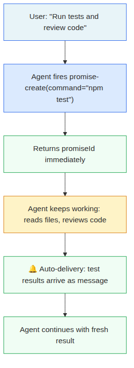
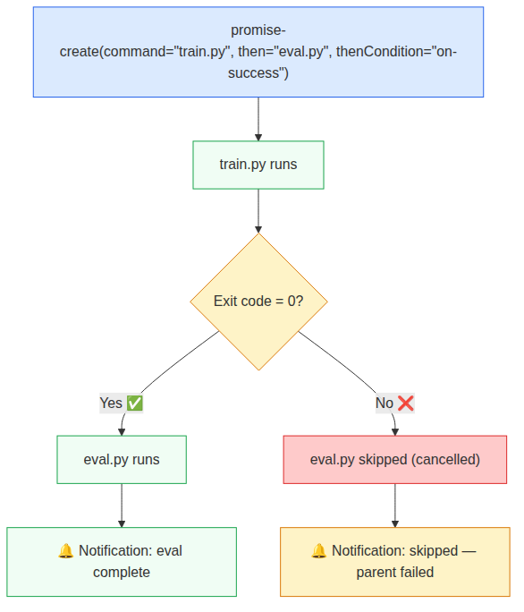
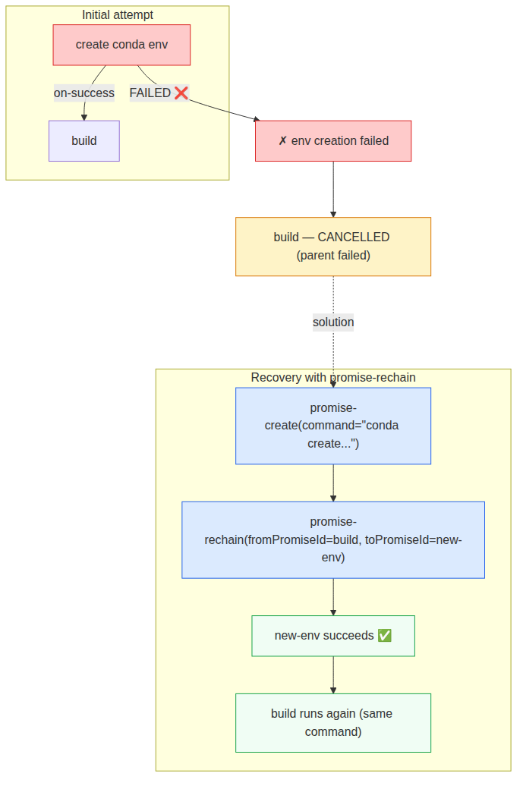
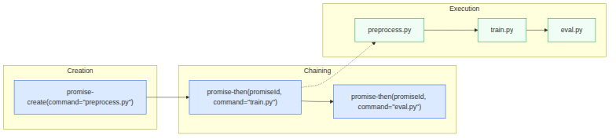

<div class="cover-page">

# bg-promises

**User Manual**

<div class="subtitle">
Non-blocking background promises — fire tasks, keep working, results auto-deliver
</div>

<div class="meta">
Version 1.0.0 — May 2026
</div>

</div>

<div class="toc">

## Table of Contents

- [1. Introduction](#1-introduction)
- [2. Quick Start Guide](#2-quick-start-guide)
- [3. Promise Lifecycle](#3-promise-lifecycle)
- [4. Tools Reference](#4-tools-reference)
  - [4.1 promise-create](#41-promise-create)
  - [4.2 promise-then](#42-promise-then)
  - [4.3 promise-status](#43-promise-status)
  - [4.4 promises-list](#44-promises-list)
  - [4.5 promise-graph](#45-promise-graph)
  - [4.6 promise-rechain](#46-promise-rechain)
  - [4.7 promise-cancel](#47-promise-cancel)
- [5. Conditional Chaining](#5-conditional-chaining)
- [6. Failure Recovery](#6-failure-recovery)
- [7. Chain Inspection](#7-chain-inspection)
- [8. Status Bar (TUI)](#8-status-bar-tui)
- [9. Multi-Step Pipeline Patterns](#9-multi-step-pipeline-patterns)
- [10. Development & Testing](#10-development--testing)
- [11. FAQ](#11-faq)

</div>

# 1. Introduction

**bg-promises** is a pi agent extension that enables non-blocking background task execution. When an LLM agent needs to run a command, download a file, or execute a script, it can fire the task as a background promise and immediately continue working on other things — reading files, editing code, answering questions. When the task completes, the result is automatically delivered as a conversation message.

The core philosophy: **fire a promise and keep working. Results arrive when ready — no polling required.**

## Key Concepts

| Concept | Description |
|---------|-------------|
| **Promise** | A background task (command or download) tracked by a unique ID |
| **Chain** | A linked list of promises where each runs after the previous completes |
| **Pre-creation** | When a `then` is specified at creation, the child promise is created immediately to eliminate race conditions |
| **Condition** | Controls whether a chained promise runs: `always`, `on-success`, or `on-failure` |
| **Terminal** | The last promise in a chain; `promise-then` always appends to the terminal |
| **Auto-delivery** | Completion/failure/skip notifications arrive as conversation messages |

## Architecture

The system is a single TypeScript module (`bg-promises.ts`) that exports 7 tools. It maintains an in-memory `Map<string, BackgroundPromise>` and uses Node.js `child_process.spawn` for commands and native `fetch` for downloads.


<div class="image-caption">Fig 1: The basic promise lifecycle — fire, keep working, auto-deliver</div>

# 2. Quick Start Guide

## Installation

```bash
# Clone or navigate to the extension
cd bg-promises

# Validate TypeScript
npm run validate     # TypeScript check — should exit cleanly with no output

# Run tests
npm test             # All tests — should pass

# Install in pi
pi install <path-to-bg-promises>
```

## Your First Promise

The simplest use: fire a command and keep working while it runs.

```
User: "Download the dataset and review the training script while it runs"

Agent:
  → promise-create(
       download="https://example.com/data.csv",
       path="./data.csv",
       name="download-data"
     )
  → "Started download: promise-123"
  → read(path="./train.py")
  → [reviews script, suggests improvements]

🔔 Promise "download-data" completed!
  Result: { path: "./data.csv", size: 1234567 }

Agent: "Download complete. Here's my review of train.py..."
```

## Chaining a Follow-Up

Attach a step that runs after the first completes:

```
promise-create(command="python preprocess.py", name="pipeline")
→ promiseId: "promise-abc"

# Later, after thinking about what to do next:
promise-then(promiseId="promise-abc", command="python train.py")
promise-then(promiseId="promise-abc", command="python eval.py")

# Result: preprocess → train → eval (auto-executing chain)
```

## Conditional Execution

Run a task only if the previous one succeeded:

```
promise-create(
  command="python train.py --epochs 100",
  then="python eval.py",
  thenCondition="on-success"
)
```

If training fails, evaluation is automatically skipped with a cancellation notification.

# 3. Promise Lifecycle

Every promise follows a well-defined lifecycle through five states:

| State | Description |
|-------|-------------|
| **pending** | Promise created but not yet started (pre-created children start here) |
| **running** | Command spawned or download in progress |
| **completed** | Exited with code 0 (command) or file downloaded (download) |
| **failed** | Exited with non-zero code or fetch error |
| **cancelled** | Explicitly cancelled by user, skipped by condition, or aborted due to parent failure |

```
pending → running → completed  (normal path)
pending → running → failed     (error path)
pending → cancelled            (cancelled before starting)
running → cancelled            (cancelled mid-execution)
```

## Pre-creation

When a `then` parameter is specified in `promise-create`, the child promise is **pre-created** immediately as a concrete object in the `pending` state, linked via `thenPromiseId`. This design eliminates a fundamental race condition: without pre-creation, `promise-then` could overwrite the mutable `thenCommand` field on an intermediate node. With pre-creation, `promise-then` always walks the linked list (`thenPromiseId`) to find the correct terminal node and writes to *its* `thenCommand`, never to an ancestor's.

<div class="tip">**Structural guarantee**: Because the child exists as a concrete object before any `promise-then` call can arrive, the race window is closed structurally — not via timing tricks or deferred notifications.</div>

# 4. Tools Reference

bg-promises provides 7 tools accessible to the LLM agent.

## 4.1 promise-create

**Start a background task.** Returns immediately with a promise ID.

```
promise-create(
  command: "npm test",                    // Shell command to execute
  download?: "https://...",               // URL to download (mutually exclusive with command)
  path?: "./data/file.zip",               // Save path for downloads
  then?: "python eval.py",                // Optional chained command
  thenCondition?: "on-success",           // Condition for chained step
  name?: "my-task"                        // Human-readable name
)
```

**Returns:**
```json
{
  "promiseId": "promise-123",
  "name": "my-task",
  "type": "command",
  "status": "started",
  "willChain": true,
  "thenCondition": "on-success"
}
```

**Parameters:**

| Parameter | Type | Required | Description |
|-----------|------|----------|-------------|
| `command` | string | Yes* | Shell command to execute |
| `download` | string | Yes* | URL to download (mutually exclusive with command) |
| `path` | string | With download | File path to save download to |
| `then` | string | No | Command to run after this one completes |
| `thenCondition` | string | No | `"always"` (default), `"on-success"`, or `"on-failure"` |
| `name` | string | No | Human-readable name for the promise |

<div class="note">**Note**: The `then` parameter only supports command-type children. For chaining downloads after a promise, use `promise-then` after creation with the `download` parameter.</div>

## 4.2 promise-then

**Chain a command or download after any existing promise.** Multiple calls create a sequential chain — each appends to the end.

```
promise-then(
  promiseId: "promise-abc",               // Existing promise to chain after
  command: "python train.py",             // Command to run (mutually exclusive with download)
  download?: "https://...",               // URL to download
  path?: "./checkpoint.pt",               // Save path for downloads
  condition?: "on-success",               // "always" (default), "on-success", "on-failure"
  name?: "training-step",                 // Name for this chained promise
  subject?: "run training"                // Semantic description
)
```

**Chain visualization returned:**

```
✓ promise-abc: preprocess (COMPLETED)
  └─ ✓ promise-def: train (COMPLETED)
       └─ ○ promise-ghi: eval (PENDING) ← just added

Path: preprocess (✓ completed) → train (✓ completed) → eval (○ pending)
```

<div class="tip">**Why chain after the fact**: You don't need to plan the full pipeline upfront. Start step 1, work on other things, and chain step 2 when you figure out what it should be. The chain auto-executes.</div>

## 4.3 promise-status

**Check promise status without blocking.** Returns the last known state.

```
promise-status(promiseId: "promise-123")
```

**Returns:**
```json
{
  "found": true,
  "promiseId": "promise-123",
  "name": "my-task",
  "type": "command",
  "status": "running",
  "result": { "output": "..." },
  "previousResult": { "output": "..." },
  "createdAt": 1778364124123,
  "completedAt": null,
  "error": ""
}
```

## 4.4 promises-list

**List all tracked promises** as a chain tree showing parent-child relationships.

```
promises-list()
```

**Output:**
```
Root chains:

✓ promise-1: test-greet (command) - COMPLETED

✓ promise-4: test-chain (command) - COMPLETED
  └─ ✓ promise-5: then-test-chain (command) - COMPLETED

✓ promise-6: test-then-root (command) - COMPLETED
  └─ ✓ promise-7: test-then-step1 (command) - COMPLETED [always]
       └─ ✓ promise-8: test-then-step2 (command) - COMPLETED
```

## 4.5 promise-graph

**Inspect chain relationships.** With a specific ID, shows that promise's chain. Without, shows all chains (forest view).

```
promise-graph(promiseId: "promise-abc")
```

**Output for specific ID:**
```
Chain for promise-abc (build):

✓ promise-xyz: env setup (COMPLETED)
  └─ ✓ promise-abc: build (COMPLETED) [on-success]

Path: env setup (✓ completed) → build (✓ completed)
Depth: 1 | Status: completed
```

## 4.6 promise-rechain

**Re-attach a cancelled or failed promise's command to a different parent chain.** This avoids manually re-creating the command — `promise-rechain` copies the original command and attaches it to the new parent's chain.

```
promise-rechain(
  fromPromiseId: "promise-4",        // Cancelled/failed promise to retry
  toPromiseId: "promise-5",          // New parent to chain after
  condition?: "on-success",          // Condition for the retried step
  name?: "retry-build",              // Optional new name
  subject?: "rebuild after fix"      // Optional semantic description
)
```

**Scenario:**

```
✗ create conda env — FAILED
  └─ ⊘ build — CANCELLED [on-success — parent failed]

→ promise-create(command="conda create...", name="new-env")
→ promise-rechain(fromPromiseId="build", toPromiseId="new-env")

✓ new-env — COMPLETED
  └─ ○ build — PENDING [on-success]  ← re-chained with same command
```

## 4.7 promise-cancel

**Cancel a pending or running promise.** Kills the child process with SIGTERM and cascades cancellation to all children in the chain.

```
promise-cancel(promiseId: "promise-123")
```

**Cancel cascade:** When a parent is cancelled, all pre-created children are also cancelled (marked as `cancelled` with reason `Parent X was cancelled`). This prevents orphaned children from running after their parent is aborted.

# 5. Conditional Chaining

Conditions control **when** a chained task runs based on the parent's outcome.

| Condition | Runs when parent... |
|-----------|---------------------|
| `"always"` | Completes **or** fails (default) |
| `"on-success"` | Completes successfully (exit code 0) |
| `"on-failure"` | Fails (non-zero exit code) |


<div class="caption">Fig 2: Conditional execution — eval runs only on training success</div>

**Practical patterns:**

```bash
# On-success: only evaluate if training succeeds
promise-create(
  command="python train.py",
  then="python eval.py",
  thenCondition="on-success"
)

# On-failure: alert only when something breaks
promise-then(
  promiseId="promise-abc",
  command="curl -X POST https://alerts.example.com/fail",
  condition="on-failure"
)

# Always: cleanup regardless of outcome
promise-then(
  promiseId="promise-abc",
  command="rm -rf /tmp/scratch",
  condition="always"
)
```

**Skipped notification:** When a condition fails its check (e.g., `on-success` on a failed parent), a "skipped" promise is created with status `cancelled` and a notification is sent:

```
⏱ Promise "eval" skipped!
• Reason: Skipped: parent promise-abc status failed did not meet condition on-success
• Parent "train" (promise-abc) status: failed
```

# 6. Failure Recovery

When a chain breaks due to a failure, subsequent `on-success` steps are automatically cancelled. Use `promise-rechain` to recover without recreating the command.


<div class="image-caption">Fig 3: Recovering from a failed chain with promise-rechain</div>

## Recovery Steps

1. **Identify the failure**: A promise failed, its downstream `on-success` children were cancelled.
2. **Fix the root cause**: Create a new root promise (e.g., fix the environment setup).
3. **Re-chain**: Use `promise-rechain` to attach the cancelled step after the new root.

```bash
# Step 1: env creation failed, build was auto-cancelled
# ✗ create-conda-env — FAILED
#   └─ ⊘ build — CANCELLED [on-success]

# Step 2: create a new working environment
promise-create(command="conda create -n myenv python=3.11", name="new-env")

# Step 3: re-chain the build step after it
promise-rechain(
  fromPromiseId="promise-build",
  toPromiseId="promise-new-env",
  condition="on-success"
)

# Result: new-env → build (same command, new parent)
```

<div class="tip">**Why not just re-create**: The build command might be complex with many flags. `promise-rechain` copies the original command from the cancelled promise, so you don't need to remember or retype it.</div>

# 7. Chain Inspection

Chains can be inspected at any time using `promise-graph` and `promises-list`.

## Specific Chain

```
promise-graph(promiseId="promise-race-11")

Chain for promise-race-11 (race-root):

✓ promise-race-11: race-root (command) - COMPLETED
  └─ ✓ promise-race-12: then-race-root (command) - COMPLETED
       └─ ✓ promise-race-13: race-then-after (command) - COMPLETED

Path: race-root (✓ completed) → then-race-root (✓ completed) → race-then-after (✓ completed)
Depth: 0 | Status: completed
```

## Forest View

```
promise-graph()

Promise chain forest:

Root chains:

✓ promise-1: test-greet (command) - COMPLETED

✗ promise-2: test-fail (command) - FAILED

⊘ promise-3: test-long (command) - CANCELLED — Cancelled by user

✓ promise-4: test-chain (command) - COMPLETED
  └─ ✓ promise-5: then-test-chain (command) - COMPLETED

Compact paths:
1. test-greet (✓ completed)
2. test-fail (✗ failed)
3. test-long (⊘ cancelled)
4. test-chain (✓ completed) → then-test-chain (✓ completed)
```

# 8. Status Bar (TUI)

The extension adds a live promise status bar to the pi TUI footer. It has two views.

## Compact View (Always Visible)

Shows each root chain as a compact path with aggregate counts:

```
①→$✓→$○ | ②→$●  ●1 ✓1
```

| Symbol | Meaning |
|--------|---------|
| `①`, `②` | Root promise index |
| `→` | Chain link |
| `$` | Command type |
| `↓` | Download type |
| `✓` | Completed |
| `●` | Running |
| `○` | Pending (pre-created child waiting) |
| `✗` | Failed |
| `⊘` | Cancelled |
| `●1 ✓1` | Aggregate: 1 running, 1 completed |

## Expanded View (Press F4)

Shows a detailed tree below the editor:

```
 ⚡ Background Promises

 ✓ $ full-pipeline
   └─→ ✓ $ step2 (on-success)
        └─→ ○ $ step3 (on-success)
        └─→ ⊘ $ notify-failure (on-failure — skipped)

Press F4 to collapse
```

Press `F4` (or `Ctrl+Shift+B`) to toggle between compact and expanded views.

# 9. Multi-Step Pipeline Patterns

## Parallel Work (The Ideal Pattern)

The most common and powerful pattern: fire a task and immediately work on something else.

```
User: "Run the test suite and while it runs, review the new API routes"

Agent:
  → promise-create(command="npm test", name="test-suite")          ← fire
  → read(path="./src/routes/api.ts")                               ← work
  → [identifies issues, suggests fixes]                            ← work

🔔 Promise "test-suite" completed!                                 ← auto
  Result: { output: "PASS 42/42" }

  → "All 42 tests pass. About the API routes..."
```

## Multi-Step Pipeline with Fallback

```
User: "Process the data, train, and evaluate. If anything fails, send an alert."

Agent:
  → promise-create(command="python preprocess.py --input raw.csv",
                   name="pipe")
  → promise-then(promiseId="promise-pipe", command="python train.py --epochs 100",
                 condition="on-success")
  → promise-then(promiseId="promise-pipe", command="python eval.py",
                 condition="on-success")
  → promise-then(promiseId="promise-pipe",
                 command="curl -X POST https://alerts/mypipeline/fail",
                 condition="on-failure")

  → [meanwhile, works on documentation, reviews code, etc.]
```


<div class="image-caption">Fig 4: Multi-step chaining — each promise-then appends to the terminal</div>

## Download + Process Chain

```bash
Agent:
  → promise-create(download="https://dataset.example.com/large.zip",
                   path="./data/large.zip", name="get-data")
  → promise-then(promiseId="promise-get-data",
                 command="unzip -o ./data/large.zip -d ./data/",
                 condition="on-success")
  → promise-then(promiseId="promise-get-data",
                 command="python preprocess.py --dir ./data/",
                 condition="on-success")

  → [meanwhile, reads paper, reviews architecture, etc.]
```

# 10. Development & Testing

## Project Structure

```
bg-promises/
├── src/extensions/downloads-wisely/
│   └── bg-promises.ts          # Main extension (~2690 lines)
├── test/
│   └── auto-injection.test.ts  # Integration tests (~700 lines)
├── skills/
│   └── bg-promises/            # Skill documentation with examples
├── package.json
└── tsconfig.json
```

## Running Tests

The test suite uses a `MockExtensionAPI` that captures sent messages instead of delivering them to a real pi session. This allows deterministic testing of auto-injection behavior.

```bash
npm test
```

**Test coverage (12 tests):**

| # | Test | What it covers |
|---|------|---------------|
| 1 | Background command → auto-injection | Basic completion notification |
| 2 | promises-list | Chain tree display |
| 3 | Failed command → auto-injection | Error notification format |
| 4 | promise-cancel on running promise | Cancellation kills process |
| 5 | Chained commands | `then` at creation, both auto-inject |
| 6 | promise-then on completed promise | Post-hoc chaining, multi-step chains, `on-success` condition |
| 7 | Pre-created child + promise-then | Race condition — promise-then appends to pre-created child |
| 8 | promise-rechain | Re-attach command to new parent |
| 9 | promise-graph | All-chains forest + specific ID query |
| 10 | on-failure condition | Skipped/cancelled child when condition fails |
| 11 | Cancel cascades to children | Pre-created child cancelled with parent |
| 12 | previousResult in chains | Parent's result propagates to child |

**Test output:**
```
═══════════════════════════════════════════
SUMMARY
═══════════════════════════════════════════

Total sentMessages (promise-completion): 23
Total sentMessages (all): 23
Tools tested: promise-create, promise-status,
              promises-list, promise-graph, promise-rechain,
              promise-cancel, promise-then

✅ All tests passed!
```

## TypeScript Validation

```bash
npm run validate
# Exits cleanly with no output (no type errors)
```

# 11. FAQ

**Q: What happens if I call promise-then on a cancelled promise?**
A: The tool returns an error: "Cannot chain to cancelled promise". Use `promise-rechain` to retry the cancelled step on a different parent.

**Q: How do conditional chains handle errors?**
A: When a parent fails, all downstream `on-success` steps are cancelled with a "skipped" notification. `on-failure` steps run. `always` steps run regardless.

**Q: Can I have multiple branches from one promise?**
A: No — chains are linear. Each node can have at most one child (via `thenPromiseId`). For branching (one `on-success` and one `on-failure`), the condition determines which path executes.

**Q: What happens when pi shuts down?**
A: All running/pending promises are cancelled with reason "pi exited — session ended". Child processes receive SIGTERM. Progress polling timers are cleared. No orphaned processes remain.

**Q: How are pre-created children different from regular children?**
A: Pre-created children are created immediately when `promise-create` is called with a `then` parameter. They exist as concrete promise objects with status `pending`. This eliminates the race condition where `promise-then` could overwrite the parent's `thenCommand` before the child is materialized.

**Q: Do downloads show progress?**
A: Yes — the status bar shows percentage and downloaded size for downloads with known Content-Length.

**Q: Is there a limit on chain length?**
A: No — chains can be arbitrarily long. Each `promise-then` appends to the terminal. However, very long chains should be broken into logical segments for manageability.
